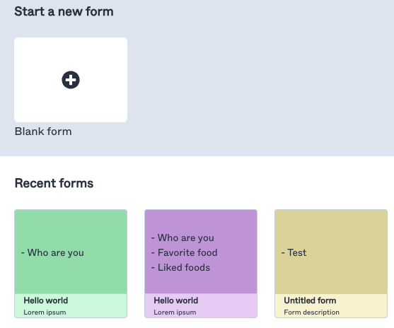
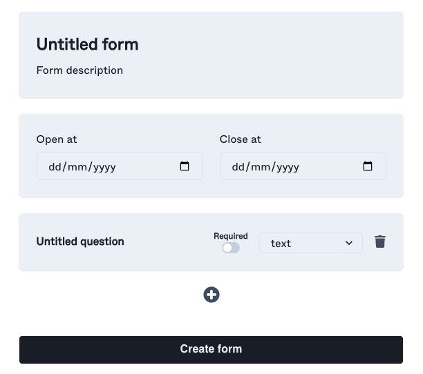
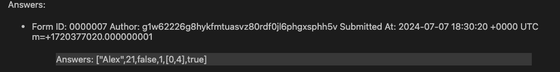
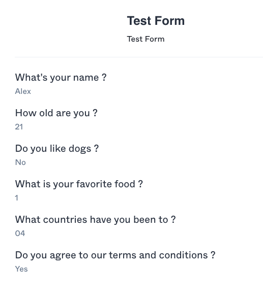
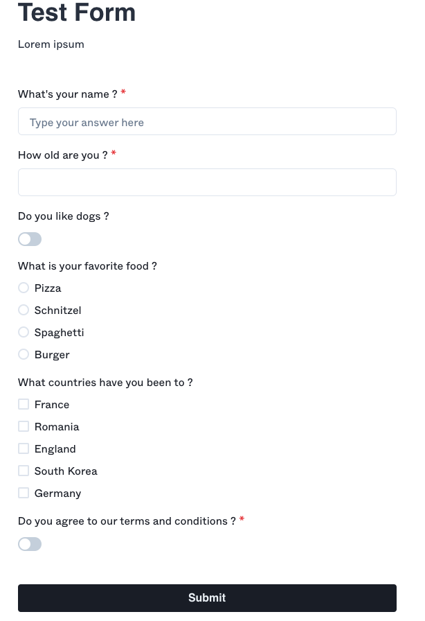

# Gno Forms

`gno-forms` is a form-editing application inspired by Google's "Google Forms" using [gno.land](https://gno.land)

---

The web application allows viewing forms and creating new ones.



### Creating a new form

Creating a new form requires passing the form's fields in a JSON format.

```bash
gnokey maketx call -pkgpath "gno.land/r/demo/forms" -func "CreateForm" -gas-fee 1000000ugnot -gas-wanted 2000000 -send "" -broadcast -chainid "dev" -args "" -args "" -args "" -args "" -args "" -remote "tcp://127.0.0.1:26657" MyKey
```

This JSON format can be generated by the web interface.



### Viewing form results

It is possible to view the form's results via the web interface or via `gno.land`




### Answering form

Again, the web interface allows for a simple way to answer a form



Although it can also be done via `gnokey`

```bash
gnokey maketx call -pkgpath "gno.land/r/demo/forms" -func "SubmitForm" -gas-fee 1000000ugnot -gas-wanted 2000000 -send "" -broadcast -chainid "dev" -args "" -args "" -remote "tcp://127.0.0.1:26657" MyKey
```

---

